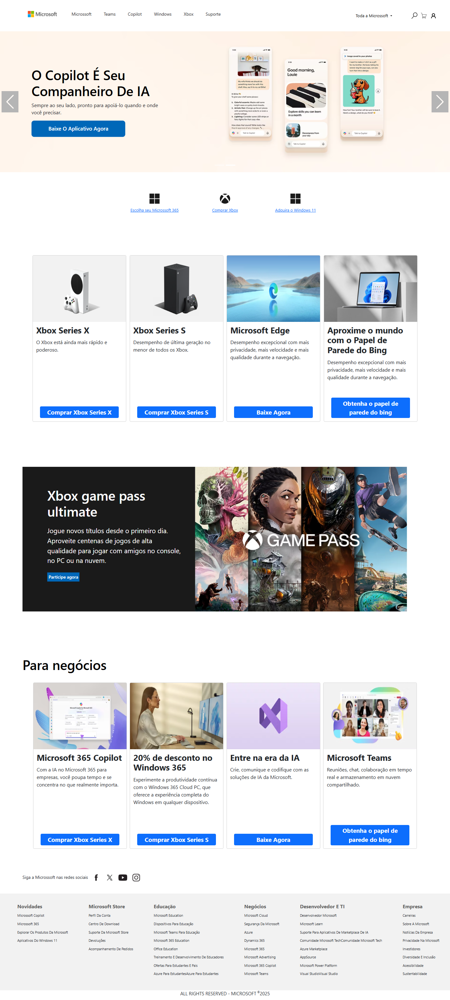

# 🖥️ Clone do Site da Microsoft

Este projeto consiste na **recriação de uma landing page da Microsoft**, com foco em **layout responsivo**, **boas práticas de HTML, CSS e JavaScript**, e uma **experiência de usuário fluida** em diferentes dispositivos.

## 🎯 Objetivo

O principal objetivo foi desenvolver um projeto sólido para compor meu portfólio como desenvolvedor Front-End. A ideia era aplicar meus conhecimentos em:

- Estruturação semântica com **HTML5**
- Estilização moderna com **CSS3**
- Interatividade com **JavaScript**
- Responsividade com técnicas de **Mobile First** e **Media Queries**

## 📱 Responsivo

A interface foi pensada para se adaptar a diferentes tamanhos de tela, oferecendo uma navegação fluida tanto em **dispositivos móveis quanto desktops**.

## 🚀 Tecnologias Utilizadas

- HTML5  
- CSS3  
- JavaScript Vanilla (puro)

## 📸 Preview

## 🔗 Acesse o projeto

## 🧠 O que aprendi

- Prática com **layouts reais de grandes empresas**
- Aperfeiçoamento em **responsividade**
- Estruturação mais limpa e organizada de arquivos
- Interatividade com JavaScript de forma leve e objetiva

---

📌 Projeto criado com fins de estudo e aprimoramento profissional.  
Feito com 💻, café ☕ e muita curiosidade.